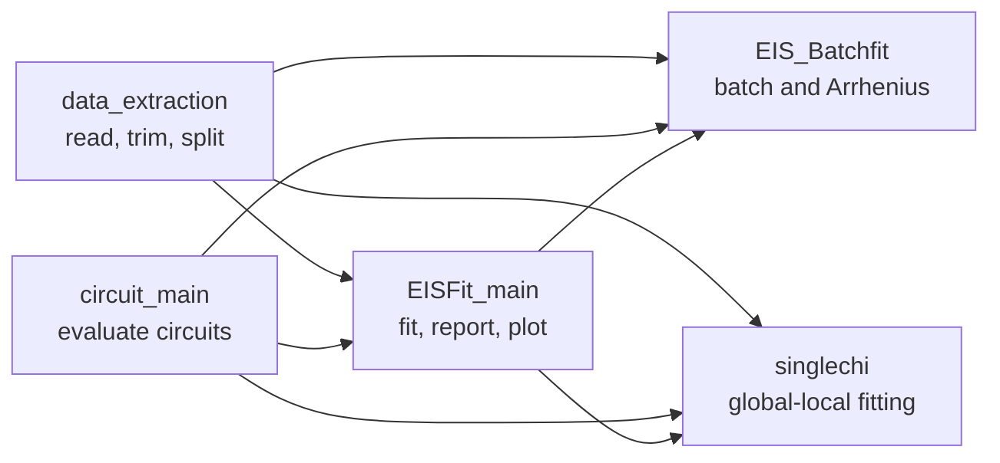

# EISFitpython documentation

EISFitpython is a Python package for simulating, fitting, plotting, and comparing
electrochemical impedance spectroscopy (EIS) data with equivalent-circuit models.
It includes single-spectrum fitting, sequential batch fitting, and a global-local
single chi-square workflow for temperature-dependent experiments.

This site documents version **0.5.1**. It complements the project README with
complete function signatures, parameter order, return values, generated files,
and workflow examples.

## 🚀 Start here

- [Install the package and build these docs](installation.md).
- Learn the [circuit-string grammar and parameter order](guides/circuit-models.md).
- Follow a [single-spectrum fitting workflow](guides/single-spectrum-fitting.md).
- Use [global-local fitting](guides/global-local-fitting.md) for shared and
  temperature-dependent parameters.
- Look up every public function in the [API reference](api/index.md).
- Review the [generated output files](generated-files.md) produced by simulations,
  reports, and plots.

## 🧩 Module relationships



## 📦 Imports

The package exposes its version at the top level. Functions remain in their
modules, so import the modules you need:

```python
import EISFitpython
from EISFitpython import circuit_main as circuits
from EISFitpython import data_extraction as data
from EISFitpython import EISFit_main as fit
from EISFitpython import EIS_Batchfit as batch
from EISFitpython import singlechi

print(EISFitpython.__version__)
```
